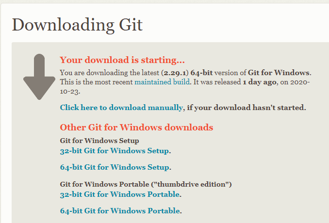
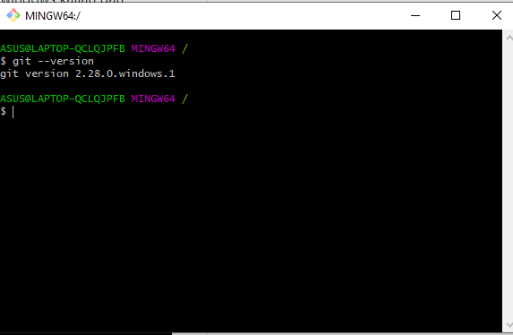
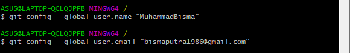
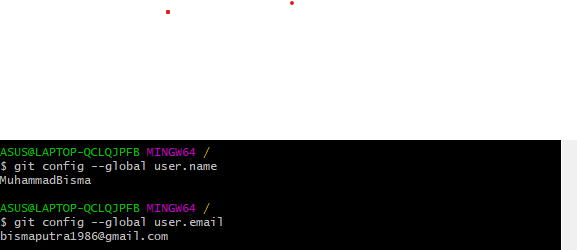
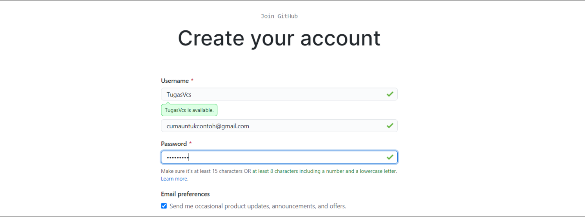
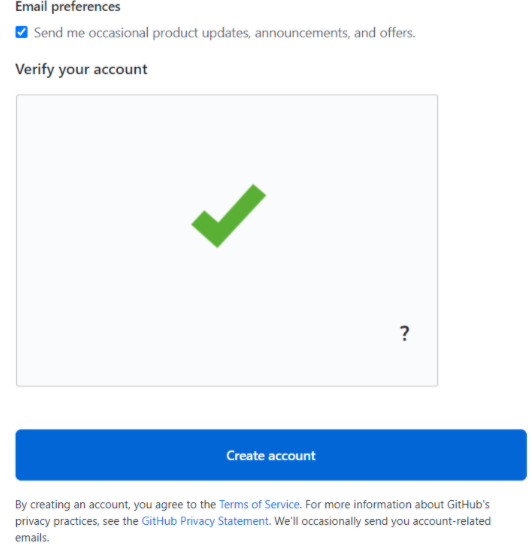
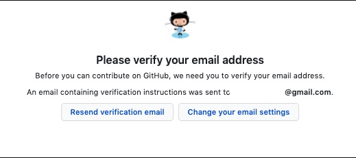
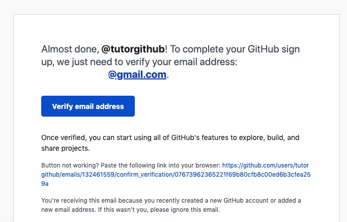
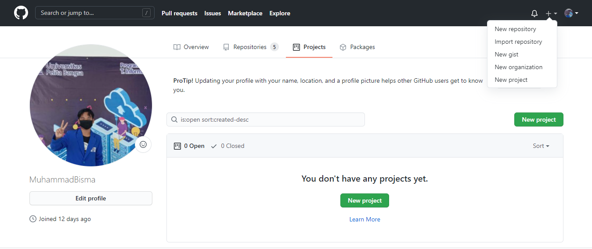

### NAMA : MUHAMMAD BISMA PUTRA HARYANA
### KELAS : TI.20.A.1
### NIM : 312010443

## LANGKAH AWAL MENGGUNAKAN GIT

* ### CARA MENDOWNLOAD GIT
   - Hal pertama yang perlu kita lakukan jika ingin menggunakan aplikasi git tentu saja yaitu mendownloadnnya. Bagaimana caranya? Pertama kalian bukalah situs resmi dari git itu sendiri yaitu *git-scm.com*.  
  
   - Setelah kalian mendapat tampilan seperti dibawah ini kalian bisa langsung saja mendownloadnya dengan cara memilih terlebih dahulu yang sesuai dengan komputer atau laptop kalian apakah itu 32bit atau 64bit. Setelahnya kalian bisa langsung menekannya dan akan terdownload  otomatis.  
     
    - Setelah installasi terbuka, kalian bisa langsung membuka software *gitbash* pada menu windows kalian dan melakukan pengecekan versi dari git kalian dengan mengetikan syntax: *git --version*  
    - jika sudah mendapat tampilan seperti gambar dibawah ini, itu mengartikan bahwa git kalian telah berhasil terinstall.  
     
   - Selanjutnya yang perlu kita lakukan adalah mengkonfigurasikan username & email kita pada git dengan mengetikan syntax:
    *'git config --global user.name "Nama Anda"'  'git config --global user.email "Email Anda"'*. Seperti pada gambar dibawah.  
     
   - Jika sudah, lakukanlah pengecekan untuk mengetahui apakah kita sudah terdaftar atau belum dengan mengetikan syntax: *'git config --global user.name'  'git config --global user.email'*. Seperti pada gambar dibawah.  
     
  
   ### LANGKAH AWAL MENGGUNAKAN GITHUB

* ### LOGIN AKUN GITHUB
  - Bukalah Github pada situs resminya yaitu *github.com*. Setelah itu pilih menu Sign Up yang terletak pada pojok kanan atas jika memang belum mempunyai akun. 
    
   - Kemudian, isilah data & email kalian dengan benar.  
    
   - Setelah itu lakukanlah verifikasi gambar, dan tekan pada bagian *'create account'*.  
    
  - Silahkan mengecek email yang sama dengan yang digunakan pada saat mendaftar tadi untuk melakukan verifikasi.  
    
  - Setelah terdapat notif dari Github pada email kalian, segera lakukanlah verifikasi sebelum terjadi error (kadaluarsa).  
    

  # SELANJUTNYA ADALAH LANGKAH MEMBUAT REPOSITORY..

### CARA MEMBUAT REPOSITORY PADA GITHUB

  - Bukalah profile kalian, kemudia pilih dibagian *start a project*, atau bisa juga dengan menekan lambang (+) pada bagian pojok kanan atas.
  - Setelahnya kamu dapat pergi pada tulisan *'New Repository'*  
    
  
  
 

  

  

