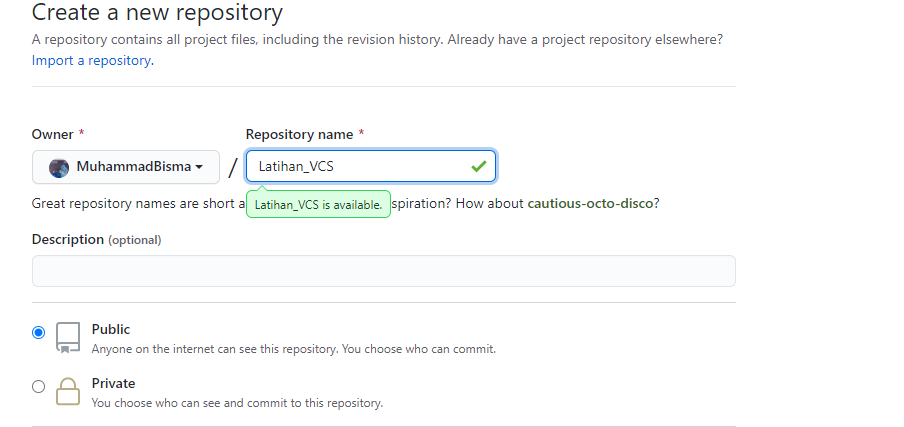
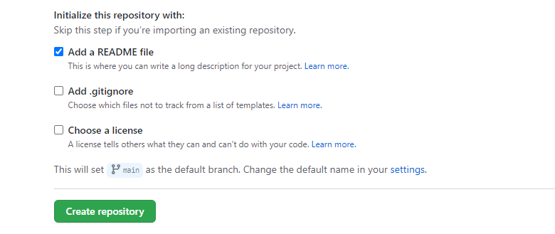
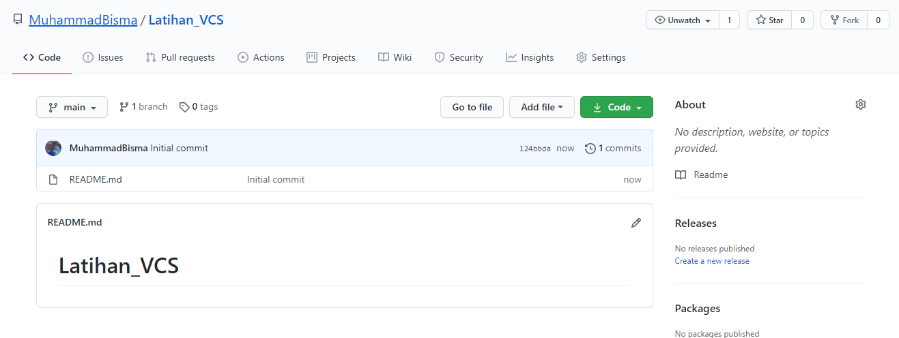
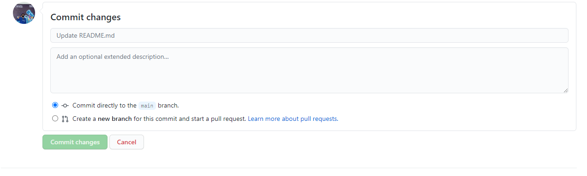
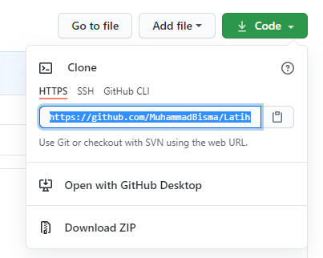
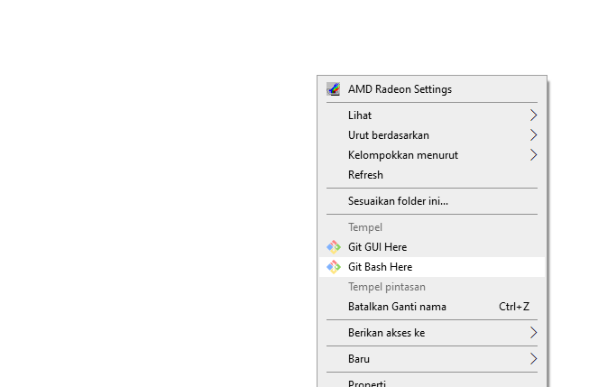
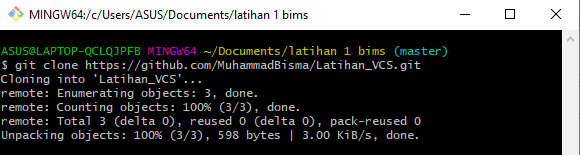
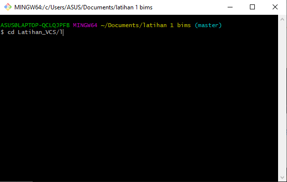
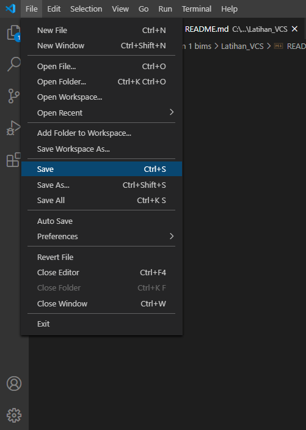

### NAMA : MUHAMMAD BISMA PUTRA HARYANA
### KELAS : TI.20.A.1
### NIM : 312010443

## LANGKAH AWAL MENGGUNAKAN GIT

* ### CARA MENDOWNLOAD GIT
   - Hal pertama yang perlu kita lakukan jika ingin menggunakan aplikasi git tentu saja yaitu mendownloadnnya. Bagaimana caranya? Pertama kalian bukalah situs resmi dari git itu sendiri yaitu *git-scm.com*.  
  
   - Setelah kalian mendapat tampilan seperti dibawah ini kalian bisa langsung saja mendownloadnya dengan cara memilih terlebih dahulu yang sesuai dengan komputer atau laptop kalian apakah itu 32bit atau 64bit. Setelahnya kalian bisa langsung menekannya dan akan terdownload  otomatis.  
     
    - Setelah installasi terbuka, kalian bisa langsung membuka software *gitbash* pada menu windows kalian dan melakukan pengecekan versi dari git kalian dengan mengetikan syntax: *git --version*  
    - jika sudah mendapat tampilan seperti gambar dibawah ini, itu mengartikan bahwa git kalian telah berhasil terinstall.  
     
   - Selanjutnya yang perlu kita lakukan adalah mengkonfigurasikan username & email kita pada git dengan mengetikan syntax:
    *'git config --global user.name "Nama Anda"'  'git config --global user.email "Email Anda"'*. Seperti pada gambar dibawah.  
     
   - Jika sudah, lakukanlah pengecekan untuk mengetahui apakah kita sudah terdaftar atau belum dengan mengetikan syntax: *'git config --global user.name'  'git config --global user.email'*. Seperti pada gambar dibawah.  
     
  
   ### LANGKAH AWAL MENGGUNAKAN GITHUB

* ### LOGIN AKUN GITHUB
  - Bukalah Github pada situs resminya yaitu *github.com*. Setelah itu pilih menu Sign Up yang terletak pada pojok kanan atas jika memang belum mempunyai akun. 
    
   - Kemudian, isilah data & email kalian dengan benar.  
    
   - Setelah itu lakukanlah verifikasi gambar, dan tekan pada bagian *'create account'*.  
    
  - Silahkan mengecek email yang sama dengan yang digunakan pada saat mendaftar tadi untuk melakukan verifikasi.  
    
  - Setelah terdapat notif dari Github pada email kalian, segera lakukanlah verifikasi sebelum terjadi error (kadaluarsa).  
    

  # SELANJUTNYA ADALAH LANGKAH MEMBUAT REPOSITORY..

### CARA MEMBUAT REPOSITORY PADA GITHUB

  - Bukalah profile kalian, kemudia pilih dibagian *start a project*, atau bisa juga dengan menekan lambang (+) pada bagian pojok kanan atas.
  - Setelahnya kamu dapat pergi pada tulisan *'New Repository'*  
     
  - Tulislah judul yang kalian inginkan. Kalian'pun juga bisa mengatur Repository yang akan kalian buat menjadi Privasi ataupun Publik.  
    
   - Pilih kolom yang bertuliskan 'README file' pada pilihan yang diberikan.  
   - Setelah itu arahkan kursor pada bagian *'Create Repository'*  
    
  - Setelah mendapat tampilan seperti gambar dibawah, berarti Repository kalian sudah berhasil dibuat. dan kalian juga bisa tekan pada tulisan 'README' yang berwarna biru untuk membukanya.  
  - Jika ingin menulis sesuatu atau mengedit sebuah teks yang sudah ada sebelumnya pada lembar kerja, kalian bisa menekan gambar pensil seperti pada gambar dibawah ini.  
    
   - Tekan pada kolom 'Commit Changes' jika kalian ingin menyimpan hasil kerja kalian ataupun setelah kalian melakukan perubahan pada lembar kerja kalian.  
    

  # SETELAH PEMBUATAN AKUN DAN REPOSITORY TELAH SELESAI SELANJUTNYA KITA AKAN ME-REMOTE REPOSITORY PADA GITBASH LOKAL.

### CARA ME-REMOTE REPOSITORY PADA GITBASH

  - Langkah pertama, kita harus menyalin terlebih dahulu link URL git kita yang ada pada Github, dengan cara tekan tombol 'Code' lalu kalian pilih pada kolom 'https://' dan setelahnya kalian Copy.  
    
   - Setelah Link URL git kita sudah tercopy. Selanjutnya, silahkan buka File Explorer pada Windows kalian. Kemudian pilih folder dimana kita akan mendownload Repository dari Github ke lokal.  
  
  - Kemudian kalian Klik Kanan, dan tekan pada kolom *'Git Bash Here'*.  
    
   - Setelahnya pop Up Command Prompt (CMD) akan terbuka. Pada proses ini kita akan melakukan download file repository yang tadi dibuat, dengan mengetikkan syntax: *'git clone "link URL yang sebelumnya telah kalian copy"'*.  
    
  - Setelah proses cloning telah selesai, pada saat ini kita masih berada pada folder awal yang dimana kita harus masuk kedalam folder yang telah kita cloning tadi yaitu *'LatihanVCS'* dengan cara mengetikkan syntax: *'cd LatihanVCS/'*  
    
  - Setelahnya kita akan masuk kedalam folder *LatihanVCS* seperti gambar dibawah ini. Kalian bisa mengedit file README.md kalian yang ada pada File Explorer dengan menggunakan Text Editor (Sublime Text, Notepad, Notepad++, Visual Studio Code) sesuai dengan keinginan kalian. Tapi jika disini saya menggunakan visual studio code untuk mengeditnya.  
   - Setelah selesai mengedit jangan lupa untuk menyimpannya dengan cara menekan tombol file yang berada dipojok kiri  atas dan pilihlah kolom save.  
    
   
 
 
 

  
 

  

  

